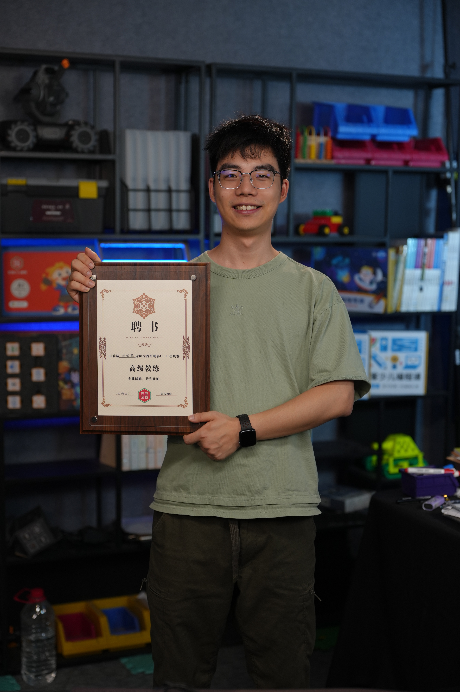
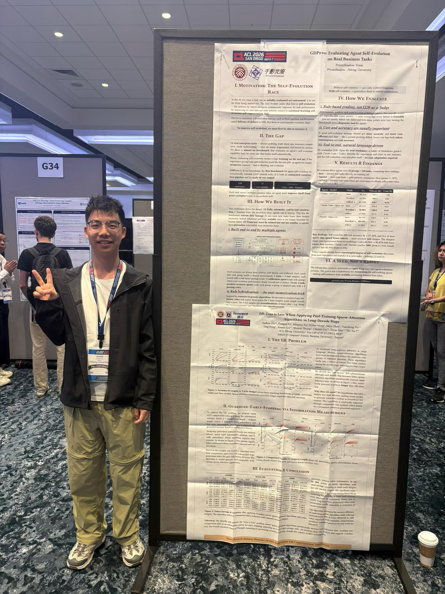

Aha~ I caught you! But thanks for your curiosity for browsing this page (hug hug ...)!

I am also a Gold-Level Coach in Competitive Programming (C++). I am deeply involved in teaching, course development, and content production, with [云睿OI](https://mp.weixin.qq.com/s/-xAtX00sAtgaVmzV9ATt4w) and [西瓜创客](https://www.xiguacity.cn/). I am committed to continually contributing to the education of the next generation. My goal is to bring students cutting-edge knowledge in AI, programming, and related fields.

I am also a Co-founder and Chief Architect of PrismShadow. Our mission is to build better self-evolving agents in vertical domains, including related benchmarks and agent harnesses. The vertical domains may include GDPR-related fields such as healthcare, finance, legal, data engineering, and more. We have already secured our first round of funding and are currently looking at a second round. Feel free to reach out!

