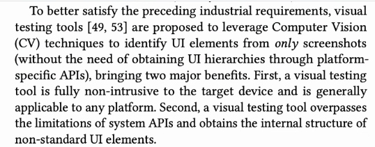

# Topic sentences

After coming up with a rough outline for whatever you need to write, the next step is to write the topic sentences.

Write the first sentence of every paragraph you intend on having. Keep them simple for now. You can improve the prose later. That is it. Don't write the paragraph bodies yet!

Now read the topic sentences.

Do those sentences convey what you wanted? Do they flow together? Are you missing any major details? I often have to iterate on these a few times.

Keep these topic sentences around. In fact, I was taught to bold them. My PhD advisor used a LaTeX macro so they can be turned on and off.

Whenever you or a collaborator needs to skim the writing, they just need to read these bolded topic sentences to understand the story.

Now go write the paragraph bodies to support the topic sentences. Doing so will probably reveal that you missed something and you'll need to refactor the topic sentences. That is part of the process.

**Another great benefit:** If you ever need to write a summary or abstract of something you have written using this process, you get the initial draft for free: copy and paste all of the topic sentences. Viola. For example, the topic sentences from a paper's Introduction makes a great starting point for the abstract!

If you can't figure out your topic sentences, then you don't know what you want to write yet, which is also helpful to realize.

Also, remember to keep the first sentence concise (not too long). Here is a bad example.

# Other tips

- xxx relies on previous work [1, 15].
  - There is a blank space between "work" and "[1, 15]".
  - "." is after [1, 15].
- code (代码), codes (密码).
- It is ...
  - In scientific writing, never use "it's".
- This tool is more desirable than ...
  - Whenever there is a comparative adjective, you have to make clear both objects. Do not simply say "A is better.".
- Do not always say "My work overpassed somebody's work", and instead say "My work complemented somebody's work".

